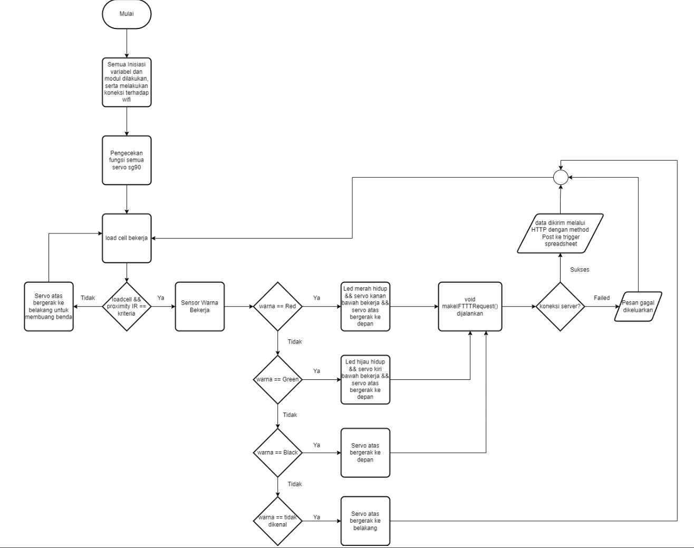
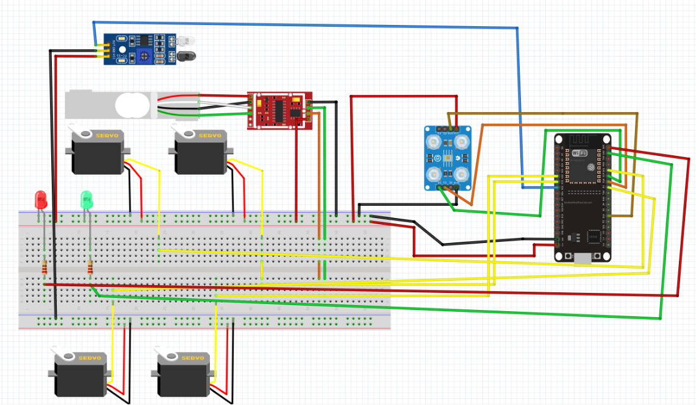
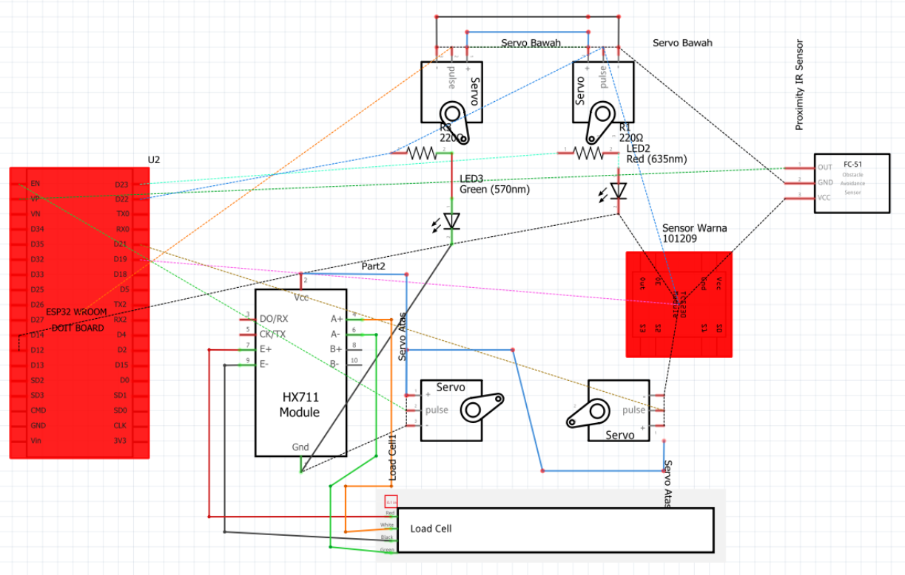
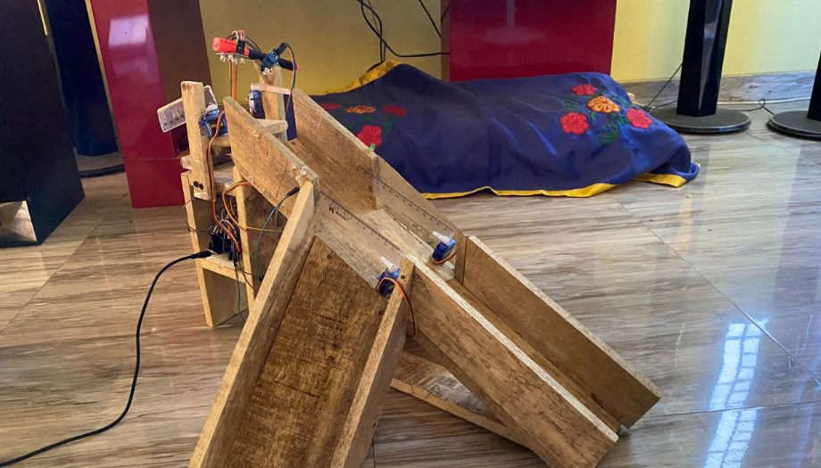
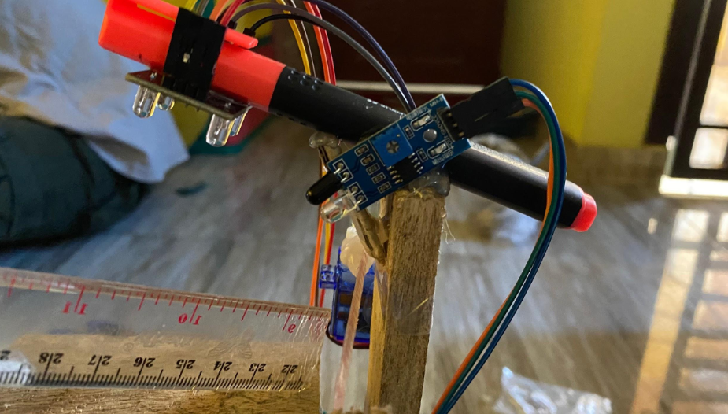
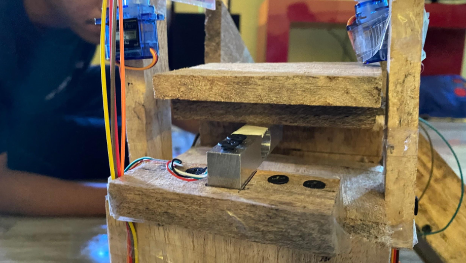
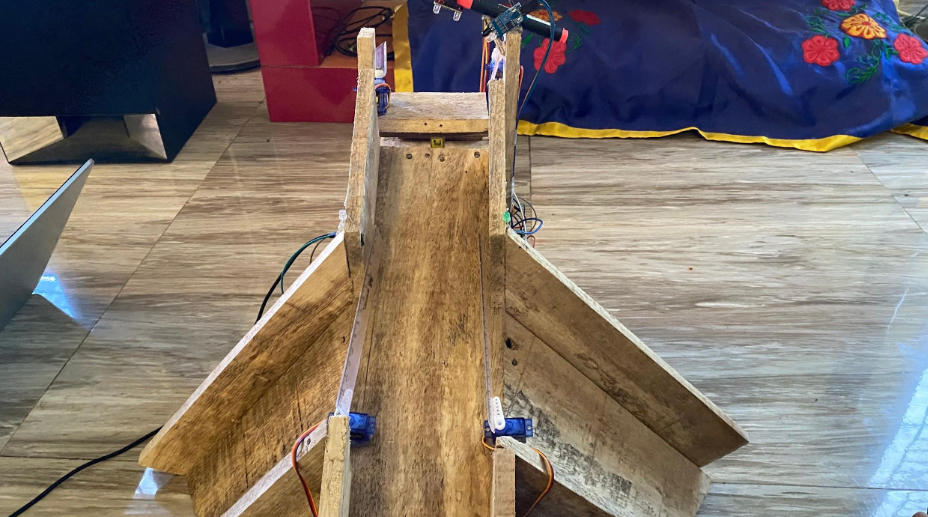

# Sortir-Buah-Tomat
Sort tomatoes with webhooks ifttt and microcontroller esp32

We design and build prototypes to help farmers sort fruit by color, the object we use is tomatoes, with the features we present in the form of webhooks using ifttt to send data to a spreadsheet

## Screenshot

Flowchart

  

Concatenation Fritzing

Schematic

  

## Screenshot Result

Prototypes

  

Up Side

Place for Color sensors and IR obstacles
  

Middle Side

Place for Load Cell sensors
  

Servo Side

Place for all Servo
  

## Tools and Materials
| Name | Type | Amount |
| :---: | :---: | :---: |
| Esp32 | Microcontroller | 1 |
| Color TCS3200 | Sensor | 1 |
| HX711 | Module | 1 |
| Esp32 | Microcontroller | 1 |
| Proximity Infrared | Sensor | 1 |
| Micro Servo SG90 | Actuator | 4 |
| LED | Actuators | 2 |
| Jumper Wire | - | ±40 |
| Resistor 220 OHM | - | 2 |
| Breadboard | - | 1 |

## Development Contributor
| Nama | NIM | Contributor |
| :---: | :---: | :---: |
| [Ryan Ernanda](mailto:ryanernanda100902@gmail.com) | 120140154 | Project Leader, Programmer, Sensor Path Maker |
| Dean Andhika Ramadhan | 120140155 | Testing and Prototypes Maker |
| Monica Adella Aisyah Renaldi | 120140144 | Design Sensor Path |
| Michelle Ayu Nastiti | 120140072 | Design Prototypes |
